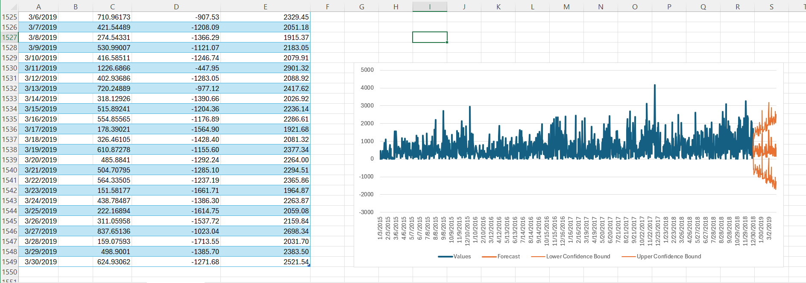

#  📊 Super Store Sales Analysis & Forecasting

## 🧾 Overview
This project is focused on analyzing Super Store sales data to extract meaningful insights and build forecasting models to predict future sales performance.

At the beginning, the idea was to use Microsoft Excel for data cleaning and create a forecasting sheet, and use Microsoft Power BI to build an interactive sales dashboard.

However, during the project, I realized that Power Bi alone was not enough for deep analysis. This pushed me to use SQL for Exploratory Data Analysis (EDA) to gain a deeper understanding of the dataset before visualization and forecasting.

## ❗ Problem Statement

- Build an interactive sales dashboard.
- Build a simple forecasting sheet for future sales prediction.
- Discover hidden patterns and trends in the data.
- Extract actionable insights using SQL queries.

## 📊 Project WorkThrough

###### Forcasting sheet for 90 Days

## 🚀 Summary of Approach
Started with Excel for initial cleaning and exploration
Shifted to SQL for deeper EDA and better control over data analysis
Planned to use Power BI for interactive dashboards and visualization
Built insights that can support forecasting and business decisions
